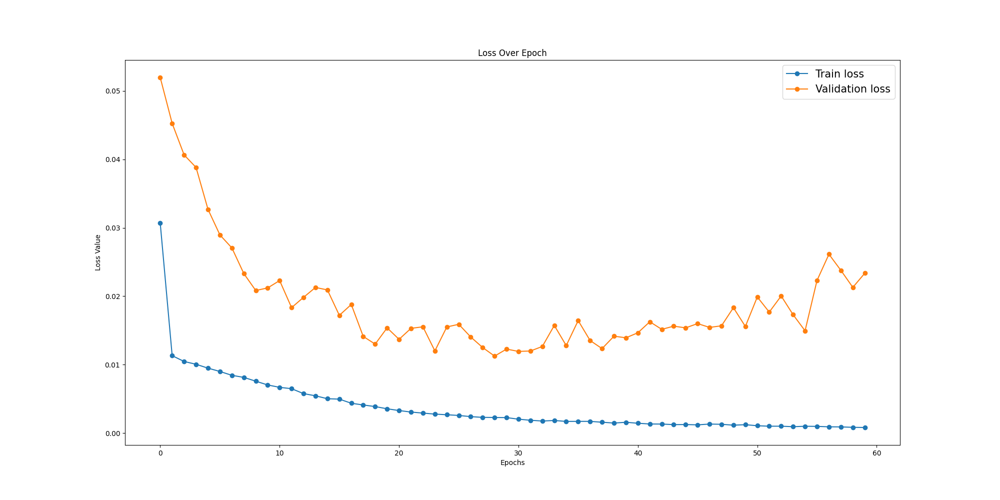
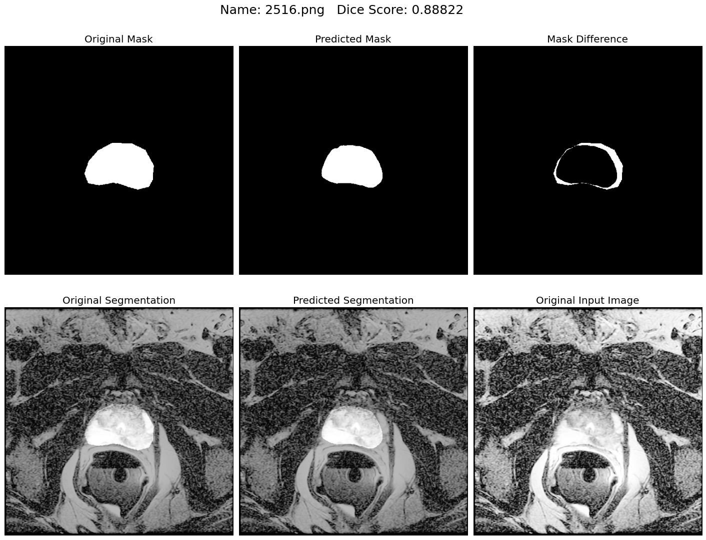
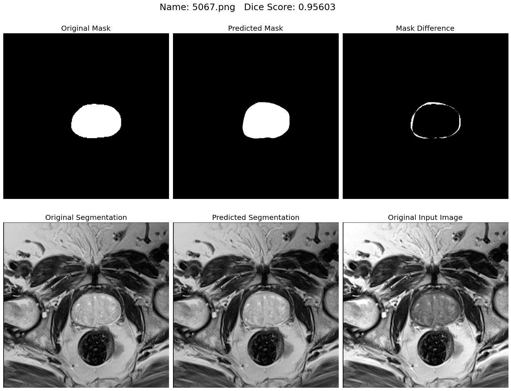

# SPLAE
 Segement Prostate Like An Expert by Jeffrey Liu.
 Playing with the promise12 dataset.

# Results

All models were trained with BS = 8, Epochs = 60 Lr = 1e-4(reduce on plateau).

Model | Aug | Dice Score | Loss
--- |:---:|:---:|:---:
U-Net_512 | Rot | 0.7649910148678267 | BCE
U-Net_512 | Rot+HFlip+VFlip | 0.7820317164718084 | BCE
[U-Net_256](logs/unet_256.txt) | Rot+HFlip+VFlip | 0.8338323765731209 | BCE
Nested U-Net | Rot+HFlip+VFlip | 0.8211480012615079 | BCE





# How to use SPLAE?

Place the data in the `file_path` folder, then run
```bash
python main.py
```
Easy enough!

The hyperparameters are in `main.py`. Change them to whatever you want.

Note that the original implementation(for brain tumor) made a threshold=0.5 for val/test, so the val score does not change initially(because the output are totally 0 after the threshold...). But after a few epochs it will become normal.

# Currently Support

- [x] [U-Net](https://arxiv.org/abs/1505.04597)
- [x] [R2U-Net](https://arxiv.org/abs/1802.06955)
- [x] [AttU-Net](https://arxiv.org/abs/1804.03999)
- [x] [R2AttU-Net](https://github.com/LeeJunHyun/Image_Segmentation)
- [x] [NestedU-Net](https://arxiv.org/pdf/1807.10165.pdf)

Will implement more networks soon.

# Todo List
- [x] [Data Augmentation]
- [x] [Make an instruction]
- [ ] [Support 5-fold validation]
- [ ] [Support multi-class segmentation]
- [x] [Support more networks]
- [ ] [Transform the output to 3D slices for submission]

## Citing SPLAE

If you use SPLAE in your research, please use the following BibTeX entry.

```BibTeX
@misc{liu2020splae,
  author =       {Xinyu Liu},
  title =        {SPLAE},
  howpublished = {\url{https://github.com/xinyuliu-jeffrey/SPLAE}},
  year =         {2020}
}
```

# Acknowlegement
This project is mainly based on [Brain Tumor Segmentation](https://github.com/sdsubhajitdas/Brain-Tumor-Segmentation) by Subhajit Das and [Unet-Segmentation-Pytorch-Nest-of-Unets](https://github.com/bigmb/Unet-Segmentation-Pytorch-Nest-of-Unets) by Malav Bateriwala. Appreciate for their great work.