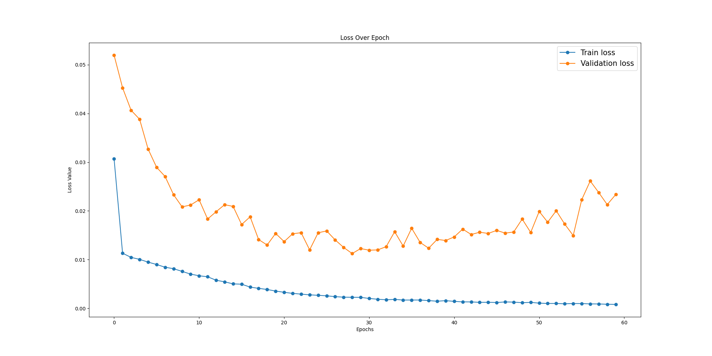
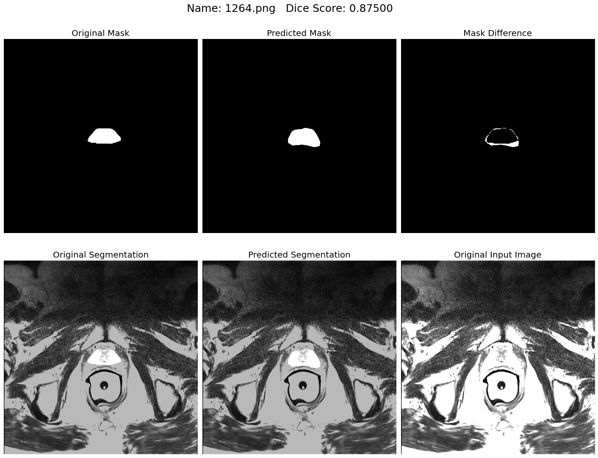

# SPLAE
 Segement Prostate Like An Expert by Jeffrey Liu.
 Playing with the promise12 dataset.

Dice Score 0.7825447279440513

# Todo List
- [ ] [Data Augmentation]
- [ ] [Make a detailed description]
- [ ] [Support multi-class segmentation]
- [x] [Support more networks]

# Acknowlegement
This project is mainly based on [Brain Tumor Segmentation](https://github.com/sdsubhajitdas/Brain-Tumor-Segmentation) by Subhajit Das and [Unet-Segmentation-Pytorch-Nest-of-Unets](https://github.com/bigmb/Unet-Segmentation-Pytorch-Nest-of-Unets) by Malav Bateriwala. Appreciate for their great work.